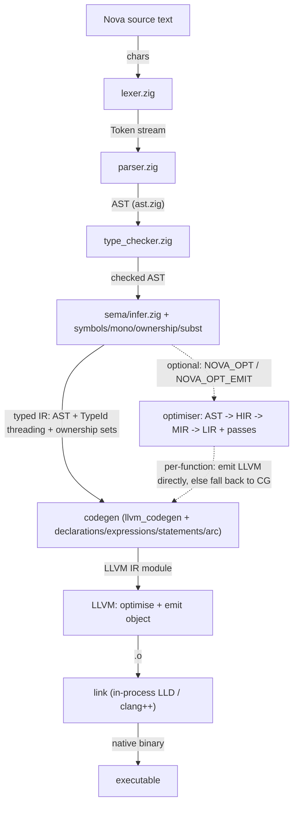

# Nova compiler: low-level design (maintainer's guide)

This is the low-level design reference for the Nova compiler (the `lang/` project). It is written for a new
maintainer who needs to be productive quickly: it explains the pipeline end to end, the one cross-cutting idea
that the whole backend rests on (the i64 value word), the module map, and then hands off to per-file sections
that document every `.zig` file and every function, public and private.

The compiler is written in **Zig 0.16**. It lowers Nova source to **LLVM IR**, then to a native object, then
links a binary (in-process LLD or `clang++`). The runtime that the produced binaries link against is written
in **C++20** and lives in `src/runtime/` (not covered here; this document is the compiler, not the runtime).

## How to read this document

- Start here for the shape of the whole thing and the ABI.
- Then jump to the section for the subsystem you are touching. Every section documents each file's role, its
  key types, and every function with its side effects and gotchas.

| Section | File | Covers |
|---|---|---|
| Frontend: lexing & parsing | [10-frontend-lexer-parser.md](10-frontend-lexer-parser.md) | `lexer.zig`, `parser.zig` |
| Frontend: AST, types, checker, formatter | [11-frontend-ast-types-typecheck-format.md](11-frontend-ast-types-typecheck-format.md) | `ast.zig`, `types.zig`, `type_checker.zig`, `formatter.zig` |
| Sema: type inference | [20-sema-infer.md](20-sema-infer.md) | `sema/infer.zig` |
| Sema: shadow IR, symbols, ownership, mono | [21-sema-shadow-symbols-ownership-mono.md](21-sema-shadow-symbols-ownership-mono.md) | `sema/{shadow,symbols,ownership,mono,lower,subst}.zig` |
| Sema: escape, ids, builtins, misc | [22-sema-misc.md](22-sema-misc.md) | `sema/{escape,alpha,builtins,ids,inst_disp,sema}.zig` |
| Codegen: core (LlvmCompiler) | [30-codegen-core.md](30-codegen-core.md) | `codegen/llvm_codegen.zig` |
| Codegen: expressions | [31-codegen-expressions.md](31-codegen-expressions.md) | `codegen/expressions.zig` |
| Codegen: declarations & statements | [32-codegen-declarations-statements.md](32-codegen-declarations-statements.md) | `codegen/{declarations,statements,coverage}.zig` |
| Codegen: ARC & type layout | [33-codegen-arc-types.md](33-codegen-arc-types.md) | `codegen/{arc,types}.zig` |
| Optimiser: HIR/MIR/LIR + passes + emit | [40-optimiser.md](40-optimiser.md) | `optimiser/*`, `optimiser/passes/*`, `codegen/lir_emit.zig` |
| CLI, pipeline, build/test drivers | [50-cli-pipeline-drivers.md](50-cli-pipeline-drivers.md) | `main.zig`, `cli.zig`, `pipeline.zig`, `builder.zig`, `tester.zig`, `format.zig`, `packages.zig`, `scaffold.zig`, `templates.zig`, `root.zig` |

## The pipeline, end to end

A `nova <file>.nova -o out` invocation flows through these stages. Each arrow is a data hand-off; the type in
brackets is what crosses the boundary.



Driver-level orchestration (which command runs which stages, cross-compilation, the `~/.nova` layout) lives
in [50-cli-pipeline-drivers.md](50-cli-pipeline-drivers.md). The frontend (source to typed IR) is sections
10-22. The backend (typed IR to LLVM) is sections 30-33. The optimiser and its optional emit path are
section 40.

## The one idea to hold in your head: everything is the i64 word

Codegen uses a single uniform value representation, `val_type` = LLVM `i64`. Every Nova value, whatever its
source type, flows through the IR as this 64-bit word. What the word holds depends on the type:

| Nova type | What the i64 word holds |
|---|---|
| `int` (32-bit), `bool`, enum discriminant | the integer, sign- or zero-extended to 64 bits |
| `long` | the 64-bit integer directly |
| `f32`, `f64` | the double's bit pattern (f32 is promoted to double first; bitcast word to `double`, operate, bitcast back) |
| `string` | a pointer to a heap allocation with an 8-byte ARC header |
| heap struct / `class` | a pointer to a heap allocation with an 8-byte ARC header |
| value struct | the address of its inline bytes (stack alloca; no ARC header) |
| array | a pointer to the element storage |
| reference optional (`string \| undefined`, `Foo \| undefined`) | a nullable pointer: `0` is absent, non-zero is the payload pointer (NOT boxed) |
| value optional (`int \| undefined`) | a pointer to an 8-byte ARC box holding the payload; `0` is absent, a non-null box is present (so a present `0` is distinguishable) |
| error union (`T \| E`) | a pointer to a 16-byte ARC box: `tag` at offset 0 (0 = ok, 1 = err), `payload` at offset 8; the ok arm is itself value-optional-boxed, so `(T\|undefined)\|E` |
| trait object | a pointer to a 16-byte ARC fat pointer: `struct_ptr` at offset 0, `vtable` at offset 8 |
| closure | a pointer to a 3-slot ARC box: `fn_ptr` at 0, `env_ptr` at 8, `__clocleanup` at 16; the env is a separate block of by-value capture words |
| `any` | a pointer to an ARC box holding the payload word plus its destructor |

The exact layouts, the box constructors, and the destructor synthesis are in
[33-codegen-arc-types.md](33-codegen-arc-types.md). The insertion points (where a value is boxed on the way
into a slot and unboxed on the way out) are in [31-codegen-expressions.md](31-codegen-expressions.md). Getting
a box or an unbox in the wrong place is the single most common source of miscompiles, so those sections are
worth reading before you touch value optionals, error unions, closures, or trait dispatch.

**The truncation trap.** Because the word is `i64` but `int` is 32-bit, an address computed as `intAddr +
offset` truncates to 32 bits and produces a garbage pointer. Heap addresses must be `long`/`ptr`, never
`int`. This is address-dependent, so it presents as a heisenbug.

## Cross-cutting concepts

- **ARC (automatic reference counting).** Not a garbage collector: retain/release are decided in
  sema/codegen. Every heap object carries an 8-byte header (`refcount` at ptr-8, `len` at ptr-4).
  `nova_retain(ptr)` bumps the count; `nova_release(ptr, dtor)` drops it and calls `dtor` before free. A
  string needs no destructor (null dtor); a struct with owned fields gets a synthesised `__destruct_*`.
  Ownership is computed in [21-sema-shadow-symbols-ownership-mono.md](21-sema-shadow-symbols-ownership-mono.md)
  (`ownership.zig`) and emitted in [33-codegen-arc-types.md](33-codegen-arc-types.md) (`arc.zig`). Verify
  memory changes with `--asan`, not just the `--arc` audit: the audit misses use-after-frees that ASAN
  catches.

- **Monomorphisation.** Generics are instantiated, not type-erased (`List<int>` becomes a distinct
  `List_int_*`). The instantiation logic is `sema/mono.zig`; type-parameter substitution is `sema/subst.zig`.

- **TypeId threading.** Sema mints a dense `TypeId` per type and threads it through the IR so codegen and the
  optimiser can make type decisions from an id rather than a type name. The id newtypes are in `sema/ids.zig`.

- **Value structs.** A plain `struct` is a value type (copied on assignment, no ARC header) unless escape
  analysis promotes it to the heap (for example a struct that is constructed and returned). The decision is
  `computeValueEscapeSet` / `isValueStructName` in `codegen/types.zig` and `sema/escape.zig`.

- **The optimiser and its two halves.** The optimiser lowers AST to HIR to MIR to LIR and runs passes
  (constfold, mem2reg, copyprop, dce, simplifycfg, arc_elision, inline). It has a report-only **shadow** half
  (`NOVA_OPT`) that runs over the whole corpus as a gauge, and an **emit** half (`NOVA_OPT_EMIT`) that turns
  the optimised MIR into LLVM directly, with a per-function fallback to the AST codegen for anything it does
  not yet handle. Both are off by default. See [40-optimiser.md](40-optimiser.md) and the status table in
  `../optimiser-pending.md`.

## Build, test, debug

```bash
cd lang
zig build                 # builds `nova`, installs to ~/.nova/bin/nova, syncs std+runtime+deps to ~/.nova
NOVA_ASAN=1 zig build     # also builds the sanitized runtime needed for the --asan gate
nova <file.nova> -o out   # compile one file
nova test <file.nova>     # run @test functions (note: skips main())
conformance/run.sh -j     # the corpus, parallel (run before AND after a change)
conformance/run.sh --asan # AddressSanitizer gate (needs NOVA_ASAN=1 build first)
conformance/run.sh --arc  # ARC leak gate (baseline-gated)
```

Debug switches: `NOVA_DUMP_MERGED=1` writes the merged IR; `NOVA_SEMA_SHADOW=1` diffs the type engines;
`NOVA_OPT_EMIT_VERBOSE=1` logs which functions the emit path took versus rejected. Environment variables are
read via `init.environ_map.get("VAR")`, never `std.posix.getenv` (which does not work in this Zig).

## A note on the directory layout

- `src/frontend/` -- lexer, parser, `ast.zig`, `type_checker.zig`, `types.zig`, `formatter.zig`.
- `src/frontend/sema/` -- the authoritative typed-IR pass: infer, mono, ownership, lower, symbols, subst,
  escape, and the shadow diff.
- `src/backend/codegen/` -- `llvm_codegen.zig` (the `LlvmCompiler`), plus `declarations.zig`,
  `expressions.zig`, `statements.zig`, `arc.zig`, `types.zig`, and `lir_emit.zig` (the optimiser emit path).
- `src/optimiser/` -- the HIR/MIR/LIR definitions, the lowering chain, the verifier, and `passes/`.
- `src/*.zig` -- the driver: `main.zig`, `cli.zig`, `pipeline.zig`, `builder.zig`, `tester.zig`, `format.zig`,
  `packages.zig`, `scaffold.zig`, `templates.zig`, `root.zig`.

Each of these is documented file by file, function by function, in the sections linked above.
